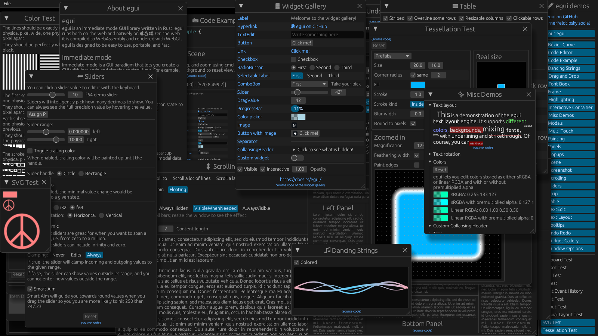

# CPU software render backend for [egui](https://github.com/emilk/egui)



```rs
let ctx = egui::Context::default();
let mut demo = egui_demo_lib::DemoWindows::default();
let mut sw_render = EguiSoftwareRender::new(ColorFieldOrder::BGRA);

let out = ctx.run(raw_input, |ctx| {
    demo.ui(ctx);
});

let primitives = ctx.tessellate(out.shapes, out.pixels_per_point);

sw_render.render(buffer, &primitives, &out.textures_delta, out.pixels_per_point);
```

- winit + softbuffer example: `cargo run --example winit`
- bevy + softbuffer example: `cargo run -p bevy_example`